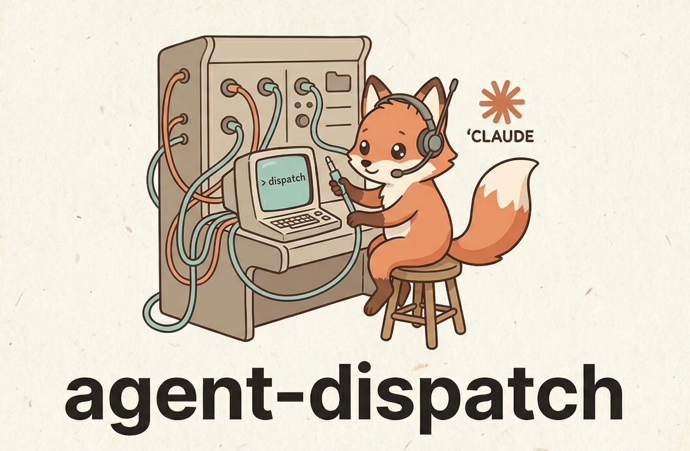

# agent-dispatch

[](https://pypi.org/project/agent-dispatch/)
[](https://github.com/ginkida/agent-dispatch/actions/workflows/ci.yml)
[](https://pypi.org/project/agent-dispatch/)
[](LICENSE)

**MCP server that lets Claude Code agents delegate tasks to agents in other project directories.**

<p align="center">
  
</p>

Each agent runs as a separate `claude -p` session in its own project directory — inheriting that project's MCP servers, CLAUDE.md, and tools. The calling agent just gets the result back.

Works with OAuth, API key, and Claude subscription authentication.

> **AI agents:** this README is the canonical doc for *using* the tool — setup: [Quick Start](#quick-start) (every step has a deterministic verify), first call: [`dispatch`](#dispatch), tool selection: [Which Tool to Use](#which-tool-to-use), failure handling: [Error Recovery](#error-recovery). Working *on* this repo instead? See [AGENTS.md](AGENTS.md).

## Quick Start

**Prerequisite:** the [Claude Code CLI](https://docs.anthropic.com/en/docs/claude-code) must be installed and authenticated. Check first:

```bash
claude --version   # must print a version — if it fails, install Claude Code before continuing
```

Then:

```bash
pip install agent-dispatch   # or: pipx install agent-dispatch

# 1. Create config + register the MCP server with Claude Code (user scope)
agent-dispatch init

# 2. Register project directories as agents — REPLACE the example paths with
#    real directories on your machine; they must exist (~ is expanded, relative
#    paths are resolved). Descriptions are auto-generated from project files.
#    No second project handy? Use the zero-setup block below instead.
agent-dispatch add infra ~/projects/infra
agent-dispatch add backend ~/projects/backend

# 3. Smoke test — dispatches a real task to the agent added in step 2 and prints
#    the answer; exit 0 on success. Default task when none given:
#    "What project is this? Describe in one sentence."
agent-dispatch test infra

# 4. Verify the whole install — prints "All checks passed." and exits 0 on success
agent-dispatch doctor
```

**Zero-setup alternative** for steps 2–3 (no second project needed — registers the current directory):

```bash
agent-dispatch add self . && agent-dispatch test self "Say hello"
```

Every Claude Code session now has the dispatch tools. Independent check: `claude mcp list` must print a line starting with `agent-dispatch:`. From inside a Claude Code session, the first MCP calls are `list_agents()`, then [`dispatch(...)`](#dispatch).

**If `init` fails to register the MCP server** (prints a warning instead of `Registered MCP server`), register manually:

```bash
claude mcp add-json agent-dispatch "{\"type\":\"stdio\",\"command\":\"$(which agent-dispatch)\",\"args\":[\"serve\"]}" --scope user
```

**If `test` fails with a permission error** (`error_type: "permission"`), grant tool access and re-test:

```bash
agent-dispatch update infra --allowed-tools "Bash,Read,Grep"      # least privilege
# or, if the agent needs everything (see SECURITY.md for the trade-off):
agent-dispatch update infra --permission-mode bypassPermissions
```

## When to Dispatch

**Do dispatch** when a task needs tools, files, or context from another project:
- Check container logs via infra agent's Portainer MCP
- Query a database via db agent's postgres MCP
- Read code or run tests in another repository

**Don't dispatch** when you can do it yourself — dispatching spawns a full Claude session.

## MCP Tools Reference

### `list_agents`

Lists all configured agents. **Call this first** to see what's available.

```json
// Response (capability + permission fields shown only when populated)
[
  {
    "name": "infra",
    "directory": "/home/user/projects/infra",
    "description": "Infrastructure agent. MCP: portainer. Stack: Python, Docker",
    "healthy": true,
    "has_claude_md": true,
    "has_mcp_config": true,
    "mcp_servers": ["portainer", "postgres"],
    "stacks": ["Python", "Docker"],
    "dbs": ["Alembic"],
    "capabilities": ["docker_logs", "deploy_debug"],
    "risky_capabilities": ["restart_services"],
    "permission_mode": "bypassPermissions",
    "allowed_tools": ["Bash", "Read", "Grep"]
  }
]
```

`mcp_servers`, `stacks`, and `dbs` are detected from the agent's project files (`.mcp.json`, `Dockerfile`, `pyproject.toml`, `Cargo.toml`, `prisma/`, `alembic.ini`, etc.) so callers can pick the right agent without dispatching a probe.

### `inspect_agent`

Cheap detailed lookup — reads the agent's files without spawning a `claude` session. Returns the full config (timeout, model, budget, permission mode, allowed/disallowed tools), detected MCP/stacks/DBs, plus short previews of `CLAUDE.md` and `README.md` when present.

| Parameter | Type | Required | Description |
|-----------|------|----------|-------------|
| `name` | string | yes | Agent name from `list_agents` |
| `preview_lines` | int | no | Max lines of CLAUDE.md/README.md (default 40, max 200, 0 disables) |

Use this **before** `dispatch_async`/`dispatch` to confirm an agent has the tools and context for your task — much cheaper than a probe dispatch.

### Groups

A **group** bundles related agents into a cross-project working set — typically a few code repos plus capability gateways (an `infra` agent with a Portainer MCP, an `analytics` agent with a browser + Yandex Metrica). It lets one orchestrating session coordinate work that spans code, deploy, and verification.

A group is a **descriptive layer, not an execution engine** — there is no router and no state machine. You pick members by reading their hints and coordinate with the normal dispatch tools. Two text fields target two audiences:

- `description` — **orchestrator-facing**: how to coordinate the group (the order of steps, who to call for what). Surfaced by `list_groups`/`inspect_group`, **never** injected into a member's prompt.
- `shared_context` — **member-facing facts** (stack names, counter ids, conventions) that hold regardless of which member reads them. Auto-prepended to a member's `context` when you pass `group=`.

Members reference agents by name; membership is many-to-many (a shared gateway can belong to several groups). Manage groups with the `agent-dispatch group` CLI (`add`/`list`/`inspect`/`update`/`remove`) or by editing `agents.yaml`.

**`list_groups()`** — cheap, no-subprocess readout of every group: description, member count, and each member's `use_for` hint + health. A member whose agent was removed is flagged `"unknown": true` rather than crashing.

**`inspect_group(name)`** — one group's full brief: `description`, the complete `shared_context`, and the member list. For a deep dive on a specific member, call `inspect_agent(member)` — `inspect_group` deliberately stays a cheap membership readout.

**Using a group** — pass `group=` to `dispatch` (or per-item in `dispatch_parallel`). The agent must be a member; its group's `shared_context` rides along automatically:

```python
# From the shop-web codebase, hand the deploy to the infra gateway.
# The "shop" group's facts (stack name, counter id) are auto-attached.
dispatch(
    agent="infra",
    task="Redeploy the shop-web container",
    caller="shop-web",
    goal="ship the checkout fix",
    group="shop",
)
```

`group=""` (the default) is byte-for-byte identical to a plain dispatch — the shared facts are folded into the `context` string, so the result cache disambiguates groups automatically and group-less calls are unaffected.

### `dispatch`

One-shot task delegation. Results are cached — identical requests within TTL return instantly.

| Parameter | Type | Required | Description |
|-----------|------|----------|-------------|
| `agent` | string | yes | Agent name from `list_agents` |
| `task` | string | yes | What to do — be specific, the agent has no context from your conversation |
| `context` | string | no | Extra context: error messages, code snippets, stack traces |
| `caller` | string | no | Your project/role — helps the agent understand who's asking |
| `goal` | string | no | Broader objective — helps the agent make better trade-offs |
| `response_format` | string | no | `"json"` to request a single JSON value; the parsed result lands in `parsed_result`. Empty = free-form text. |
| `return_ref` | bool | no | When `true`, returns just a `ref` + summary preview instead of the full result text. Use `fetch_result(ref)` to load the full text on demand. |
| `summary_chars` | int | no | Max chars of result text to include in the ref response (default 500). |
| `timeout_seconds` | int | no | One-off timeout override for this call (0 = agent's configured timeout; clamped to 10–7200). No config edit needed for known-long tasks. |
| `group` | string | no | Group name (from `list_groups`). The agent must be a member; the group's `shared_context` (member-facing facts) is auto-prepended to `context`. Empty = plain dispatch. See [Groups](#groups). |

```python
# Call — recommended form (always include caller and goal)
dispatch(
    agent="infra",                # must exist in list_agents()
    task="Check container logs for errors related to the scheduler service",
    context="Error: TypeError at scheduler.py:42",
    caller="backend",             # your project/role
    goal="debug production crash" # the broader objective
)
```

```json
// Response (success)
{
  "agent": "infra",
  "success": true,
  "result": "Found 3 errors in container logs: TypeError in scheduler.py:42...",
  "session_id": "sess-abc-123",
  "cost_usd": 0.02,
  "duration_ms": 5000,
  "num_turns": 2
}

// Response (failure — error_type helps you handle programmatically)
{
  "agent": "infra",
  "success": false,
  "result": "",
  "error": "Tool_use is not allowed in this permission mode\n\nHint: ...",
  "error_type": "permission"
}
```

**`error_type` values:** `permission` (tool/action denied), `timeout`, `recursion` (dispatch depth exceeded), `not_found` (missing directory or CLI), `cli_error` (other failures). Permission errors include an actionable hint.

**Resumable timeouts:** every fresh dispatch pre-assigns a session UUID (`--session-id`), so a timed-out dispatch still returns a `session_id` — the partial transcript survives the kill. The timeout error spells out the recovery: resume with `dispatch_session(agent, "Continue where you left off", session_id=...)`, retry with a bigger `timeout_seconds`, or use `dispatch_async`.

**Denied-tools visibility:** in non-interactive mode the claude CLI auto-denies tools the agent isn't allowed to use — the agent then often "succeeds" with an answer like *"I need your permission for one read-only query"*. When that happens the response carries the deterministic signal: `denied_tools` (parsed from the CLI's `permission_denials`) plus a `hint` explaining the result may be incomplete and how to grant access. `success` stays `true` — it's a soft signal, not a failure.

```json
// Response (success, but a tool was blocked)
{
  "agent": "analysis",
  "success": true,
  "result": "Here is the offline mapping. To finish I'd need to run one read-only query...",
  "denied_tools": ["Bash"],
  "hint": "1 tool call(s) were denied by permissions: Bash. The result may be incomplete..."
}
```

**Structured JSON output:** pass `response_format="json"` to ask the agent for a single JSON value. The runner appends an instruction footer ("respond with a single valid JSON value, no fences, no prose") and on success parses the response — the parsed value lands in `parsed_result`. The raw text is always in `result`. Parse failures leave `parsed_result=None` but don't fail the dispatch (soft mode).

```json
// Response with response_format="json"
{
  "agent": "infra",
  "success": true,
  "result": "{\"errors\": 3, \"first_at\": \"14:02\"}",
  "parsed_result": {"errors": 3, "first_at": "14:02"}
}
```

**Always pass `caller` and `goal`** — the dispatched agent sees a structured prompt:

```markdown
## Goal
debug production crash

## Dispatched by
backend

## Context
Error: TypeError at scheduler.py:42

## Task
Check container logs for recent errors related to the scheduler service
```

### `dispatch_session`

Multi-turn: continue a conversation with an agent. First call starts a session, pass `session_id` back to continue. Never cached.

| Parameter | Type | Required | Description |
|-----------|------|----------|-------------|
| `agent` | string | yes | Agent name |
| `task` | string | yes | Task or follow-up message |
| `session_id` | string | no | From previous response — empty for new session |
| `context` | string | no | Extra context |
| `caller` | string | no | Who is dispatching |
| `goal` | string | no | Broader objective |
| `timeout_seconds` | int | no | One-off timeout override (0 = agent default; clamped to 10–7200) |

`dispatch_session` is also the **timeout recovery path**: a timed-out `dispatch` returns a `session_id` — pass it here with `task="Continue where you left off"` to salvage the partial work instead of restarting.

```
Turn 1: dispatch_session("infra", "List running containers")
         → session_id: "sess-abc"

Turn 2: dispatch_session("infra", "Restart the nginx one", session_id="sess-abc")
         → agent remembers previous context
```

### `dispatch_parallel`

Run multiple tasks concurrently. Much faster than sequential `dispatch` calls.

| Parameter | Type | Required | Description |
|-----------|------|----------|-------------|
| `dispatches` | string (JSON) | yes | JSON array of `{"agent", "task", "context?", "caller?", "goal?", "response_format?", "return_ref?", "summary_chars?", "timeout_seconds?", "group?"}` (a per-item `group` validates membership up front and auto-injects its `shared_context`) |
| `aggregate` | string | no | Agent name to synthesize all results into one answer |

**Important:** `dispatches` is a JSON string, not a list.

```json
// Input
[
  {"agent": "infra", "task": "check pod logs for errors", "caller": "backend", "goal": "debug crash"},
  {"agent": "db", "task": "are all migrations applied?", "caller": "backend", "goal": "debug crash"}
]
```

```json
// Response (without aggregate)
[
  {"agent": "infra", "success": true, "result": "No errors in pod logs", ...},
  {"agent": "db", "success": true, "result": "All migrations applied", ...}
]
```

```json
// Response (with aggregate="backend")
{
  "individual_results": [
    {"agent": "infra", "success": true, "result": "No errors in pod logs", ...},
    {"agent": "db", "success": true, "result": "All migrations applied", ...}
  ],
  "aggregated": {
    "agent": "backend",
    "success": true,
    "result": "Summary: all systems nominal. No pod errors, all migrations applied."
  }
}
```

### `dispatch_stream`

Same as `dispatch` but shows live progress while the agent works. Use for long-running tasks. Not cached.

Parameters are the same as `dispatch` except `return_ref`/`summary_chars` (streaming is incompatible with ref-mode).

### `dispatch_dialogue`

Two agents collaborate through multi-turn conversation. Never cached.

| Parameter | Type | Required | Description |
|-----------|------|----------|-------------|
| `requester` | string | yes | Agent with the problem/context |
| `responder` | string | yes | Agent with the expertise/tools |
| `topic` | string | yes | Problem or question to discuss |
| `max_rounds` | int | no | Max back-and-forth rounds (default: 3, max: 10) |

Each round costs up to 2 dispatches. Agents signal completion with `[RESOLVED]`.

```json
// Response
{
  "resolved": true,
  "rounds": 2,
  "total_cost_usd": 0.04,
  "total_duration_ms": 12000,
  "final_answer": "Staging had 1 pending migration. Applied successfully.",
  "conversation": [
    {"agent": "db", "role": "responder", "round": 1, "message": "Which environment?", "cost_usd": 0.01},
    {"agent": "backend", "role": "requester", "round": 1, "message": "Staging", "cost_usd": 0.01},
    {"agent": "db", "role": "responder", "round": 2, "message": "Applied. [RESOLVED]", "cost_usd": 0.01}
  ]
}
```

### `add_agent`

Register a new project directory as an agent. Description is auto-generated from project files if omitted.

| Parameter | Type | Required | Description |
|-----------|------|----------|-------------|
| `name` | string | yes | Agent name (letters, digits, hyphens, underscores) |
| `directory` | string | yes | Path to an existing project directory (`~` is expanded, relative paths resolved) |
| `description` | string | no | What this agent can do — auto-generated if empty |
| `timeout` | int | no | Timeout in seconds (0 = use global default) |
| `max_budget_usd` | float | no | Max cost in USD per dispatch (0 = no limit) |
| `permission_mode` | string | no | Permission mode (e.g. `default`, `plan`, `bypassPermissions`) |
| `allowed_tools` | string | no | Comma-separated allowed tools (e.g. `"Bash,Read,Edit"`) |
| `disallowed_tools` | string | no | Comma-separated disallowed tools |

### `update_agent`

Update an existing agent's configuration. Only non-empty fields are changed. Pass `"none"` to clear a field.

| Parameter | Type | Required | Description |
|-----------|------|----------|-------------|
| `name` | string | yes | Agent name to update |
| `description` | string | no | New description |
| `timeout` | int | no | New timeout (0 = don't change) |
| `max_budget_usd` | float | no | New budget limit (0 = don't change, negative = clear the limit) |
| `model` | string | no | Model override. `"none"` to clear |
| `permission_mode` | string | no | Permission mode. `"none"` to clear |
| `allowed_tools` | string | no | Comma-separated. `"none"` to clear |
| `disallowed_tools` | string | no | Comma-separated. `"none"` to clear |

### `remove_agent`

Remove an agent from config.

| Parameter | Type | Required | Description |
|-----------|------|----------|-------------|
| `name` | string | yes | Agent name to remove |

### `cache_stats` / `cache_clear`

View cache hit rate and size, or clear all cached results.

### Result references — `return_ref` + `fetch_result`

For dispatches whose result text is large (audits, log dumps, code searches), passing the full text back inflates the calling agent's context. Use `return_ref=True` to get just a small reference instead:

```
dispatch(agent="infra", task="audit every container", return_ref=True, summary_chars=200)
  -> {"ref": "8f3a...e1", "agent": "infra", "success": true,
      "size": 14823, "summary_chars": 200,
      "summary": "Inspected 32 containers. Found 3 OOM kills in the last hour:\n- worker-3...",
      "cost_usd": 0.08, "duration_ms": 9200}

// Later, when you actually need to read the result:
fetch_result(ref="8f3a...e1")              -> full DispatchResult JSON
fetch_result(ref="8f3a...e1", max_chars=2000)  -> truncated, plus {"truncated": true, "full_size": 14823}
```

Refs reuse the same storage as `dispatch_async` jobs (under `~/.config/agent-dispatch/jobs/`), so any `job_id` returned by `dispatch_async` is also a valid `ref` for `fetch_result`. `parsed_result` (when `response_format="json"` is set) is small and is always inlined directly in the ref response — no second fetch needed.

### Async dispatch — `dispatch_async`, `dispatch_status`, `dispatch_wait`, `dispatch_cancel`, `dispatch_jobs`, `dispatch_gc`

When a dispatched task is going to take a while, you don't want to block your own tool slot for minutes. Async dispatch returns a `job_id` immediately and lets you check back when you're ready.

```
// 1. fire and forget (timeout_seconds= works here too for known-long tasks)
dispatch_async(agent="infra", task="audit every container log for OOM kills today")
  -> {"job_id": "8f3a...e1", "status": "pending", "agent": "infra"}

// 2. do other work, then check progress (non-blocking)
//    `progress` is a rolling tail of what the agent is doing right now
dispatch_status(job_id="8f3a...e1")
  -> {"id": "8f3a...e1", "status": "running", "started_at": 1730000123.4,
      "progress": ["Using tool: Bash", "Scanning container logs for OOM events..."], ...}

// 3. or block until done (timeout_seconds default: 60, capped at 3600)
dispatch_wait(job_id="8f3a...e1", timeout_seconds=120)
  -> {"id": "8f3a...e1", "status": "done", "result": {"agent": "infra", "success": true, ...}}

// If the timeout fires, the job keeps running:
  -> {"id": "...", "status": "running", "timed_out_waiting": true}
```

`dispatch_cancel(job_id)` cancels a **pending** job, and also kills a **running** job's `claude` subprocess when the job was started by the same server instance (the job is marked `cancelled` first, so the worker's trailing write can't undo it; partial work is lost but the progress tail is preserved). A running job started by a *previous* server run can't be killed safely and is left to finish. The response carries an `outcome` of `cancelled`, `cancelled_running`, `running` (not owned by this server), `already_terminal`, or `not_found`.

Async workers run with streaming under the hood: the job file keeps a rolling tail (last 20 lines, ~1 write/sec) of assistant text and tool-use events. `dispatch_status` shows it as `progress` while the job runs and keeps it afterwards as a post-mortem trace; `dispatch_jobs` shows `last_progress` for running jobs.

`dispatch_jobs(status?)` lists recent jobs as summaries (filter by `pending` / `running` / `done` / `failed` / `cancelled`). `dispatch_gc(max_age_days=7)` purges terminal jobs older than the threshold — pending and running jobs are never deleted.

Job state persists to disk at `~/.config/agent-dispatch/jobs/` (override with `AGENT_DISPATCH_JOBS_DIR`). One JSON file per job, written owner-only (`0o600`) with atomic writes — safe to read or `ls` while jobs are in flight. Caller-supplied `job_id`s are validated as 32-char hex before any file access (no path traversal). On startup the server marks jobs left in `running` by a crashed instance as `failed` once they are stale (stuck for over an hour).

| When to use async | When to use `dispatch` |
|-------------------|------------------------|
| Long task (minutes) — you want to keep working | Short task — you need the answer right now |
| Several long tasks you'll collect later | Several short tasks → `dispatch_parallel` |
| Don't care about caching (each call is a fresh job) | Cached by default — identical requests are free |

## Which Tool to Use

| Scenario | Tool |
|----------|------|
| Quick one-off question to another project | `dispatch` |
| Multi-step workflow with follow-ups | `dispatch_session` |
| Need answers from several agents at once | `dispatch_parallel` |
| Long task, want to see progress | `dispatch_stream` |
| Two agents need to collaborate | `dispatch_dialogue` |
| Need a combined summary from multiple agents | `dispatch_parallel` with `aggregate` |
| Long task — don't block your tool slot | `dispatch_async` + `dispatch_wait` |
| Check progress without blocking | `dispatch_status` |
| Known-long task, one-off | any dispatch tool with `timeout_seconds=...` |
| A dispatch timed out | `dispatch_session` with the `session_id` from the error |
| Coordinating a set of related projects | define a [group](#groups), then `dispatch(..., group=name)` |
| See which agents form a working set | `list_groups` / `inspect_group` |

## Error Recovery

Failures are deterministic: check `success`, then branch on `error_type`.

| `error_type` | Meaning | Recovery |
|--------------|---------|----------|
| `permission` | A tool call was denied | `update_agent(name, allowed_tools="Bash,Read")` (least privilege) or `update_agent(name, permission_mode="bypassPermissions")`, then re-dispatch. The `error` text includes a hint with the exact fix. |
| `timeout` | Process killed at the timeout | Resume the partial work: `dispatch_session(agent, "Continue where you left off", session_id=<from the error text>)`. Or retry with a bigger `timeout_seconds=`, or use `dispatch_async`. |
| `not_found` | Agent directory or `claude` CLI missing | `list_agents()` → check `healthy`. Re-add the agent with an existing path, or run `agent-dispatch doctor` to find what's missing. |
| `recursion` | Dispatch nesting exceeded `max_dispatch_depth` (default 3) | Don't dispatch from dispatched agents; if the nesting is intentional, raise `max_dispatch_depth` in settings. |
| `cli_error` | Anything else from the `claude` subprocess | Read the `error` text; run `agent-dispatch doctor` for environment issues; retry once if transient. |

Three soft signals that arrive with `success: true`:

- **`denied_tools` + `hint`** — the agent finished but some tool calls were blocked; the result may be incomplete. Grant access (see the `permission` row) and re-dispatch.
- **`parsed_result: null` with `response_format="json"`** — the reply wasn't valid JSON; the raw text is still in `result`. Caveat: an agent that *can't* comply returns `{"error": "<reason>"}` — which parses successfully — so also check `parsed_result` for an `"error"` key.
- **`budget_exceeded: true`** — `cost_usd` exceeded the agent's `max_budget_usd` (or the settings default). The dispatch is not failed — the money is already spent — but a runaway agent is now visible. Tighten the task, pick a cheaper model, or raise the budget.

Tool-level errors (unknown agent, malformed input) return a plain envelope instead of a `DispatchResult`:

```json
{"error": "Unknown agent: 'foo'. Available: infra, db, monitoring"}
```

## Configuration

Config at `~/.config/agent-dispatch/agents.yaml` (override: `AGENT_DISPATCH_CONFIG` env var):

```yaml
agents:
  infra:
    directory: ~/projects/infra
    description: "Infrastructure agent. MCP: portainer."
    timeout: 300            # seconds, default: 300
    capabilities:           # capability labels, shown in list_agents
      - docker_logs
      - deploy_debug
    risky_capabilities:     # high-risk labels, surfaced for visibility
      - restart_services
    # model: sonnet         # optional model override
    # max_budget_usd: 1.0   # cost limit per dispatch
    # permission_mode: bypassPermissions  # one of: default | plan | bypassPermissions
    # allowed_tools:        # restrict which tools the agent can use
    #   - Read
    #   - Grep
    # disallowed_tools:     # block specific tools
    #   - Write

settings:
  default_timeout: 300
  # default_permission_mode: bypassPermissions  # inherited by all agents
  # default_allowed_tools:                      # inherited when agent has none
  #   - Bash
  #   - Read
  #   - Edit
  max_dispatch_depth: 3     # recursion protection
  max_concurrency: 5        # max parallel claude -p processes (per dispatch path)
  cache:
    enabled: true
    ttl: 300                # seconds
    max_size: 1000          # max cached entries; oldest evicted first (FIFO)
```

Config is reloaded on every tool call — add agents without restarting.

### Auto-Description

`agent-dispatch add` without `--description` generates one from:

- `CLAUDE.md` — first meaningful paragraph (priority)
- `README.md` — first substantial line (fallback)
- `pyproject.toml` / `package.json` — project description
- `.mcp.json` — lists MCP server names
- Stack indicators — Docker, Rust, Go, Python, Node.js
- DB indicators — Prisma, Alembic, migrations

### Explicit Capabilities

Auto-description is useful, but explicit `capabilities` make it clearer what each agent is for. Add short snake_case task labels to agents:

```bash
agent-dispatch update infra \
  --capabilities docker_logs,deploy_debug \
  --risky-capabilities restart_services
```

`list_agents` and `inspect_agent` surface `capabilities` and `risky_capabilities` so the caller can pick the right agent at a glance — `risky_capabilities` flags higher-risk abilities (e.g. restarting services) for extra scrutiny.

## How It Works

```
Your Claude Code session
  │
  ├─ dispatch("infra", "find errors", caller="backend", goal="debug crash")
  │
  ▼
agent-dispatch MCP server
  ├─ cache check → hit? return cached result
  ├─ semaphore → limit concurrent processes
  └─ subprocess.run("claude -p ...", cwd=~/projects/infra/)
       │
       ▼
     New Claude Code session in ~/projects/infra/
       ├─ Inherits: CLAUDE.md, .mcp.json, project tools
       ├─ Receives structured prompt with goal/caller/context/task
       └─ Returns result → cached for future identical requests
```

## Safety

- **Recursion protection** — `AGENT_DISPATCH_DEPTH` env var tracks nesting. Default limit: 3. Best-effort across the subprocess boundary (see [SECURITY.md](SECURITY.md)).
- **Argument-injection guard** — structured CLI fields (`session_id`, `model`, `permission_mode`, tool names) that start with `-` are rejected so they can't smuggle extra `claude` flags.
- **Path-traversal guard** — caller-supplied `job_id`/`ref` values are validated as 32-char hex before any filesystem access.
- **Owner-only state** — job files (`0o600`) and `agents.yaml` (`0o600`) are written for the owner only; their directories are `0o700`.
- **Cost visibility** — `max_budget_usd` per agent or globally; a dispatch whose cost exceeds it returns `budget_exceeded: true` + a hint (post-hoc — the `claude` CLI has no spend cap, so the overage can be flagged but not prevented).
- **Concurrency** — `max_concurrency` (default: 5) caps parallel `claude -p` processes. Note: the sync and async dispatch paths use separate semaphores, so the worst-case total is `2 × max_concurrency`.
- **Timeout** — per-agent or global (default: 300s). Orphaned processes are cleaned up.
- **Caching** — identical `(agent, task, context, caller, goal, response_format)` requests return cached results, bounded by `cache.max_size` (oldest entry evicted first). Only successes are cached. Sessions and dialogues are never cached.

See [SECURITY.md](SECURITY.md) for the full threat model (including the `bypassPermissions` escalation risk and on-disk job files).

## CLI

| Command | Description |
|---------|-------------|
| `agent-dispatch init` | Create config + register MCP server with Claude Code |
| `agent-dispatch add <name> <dir>` | Add an agent (auto-generates description) |
| `agent-dispatch update <name>` | Update agent config (permissions, timeout, model, etc.) |
| `agent-dispatch remove <name>` | Remove an agent |
| `agent-dispatch list` | List agents with health status and permissions |
| `agent-dispatch describe <name>` | Show full configuration for one agent (tri-state tools, project files) |
| `agent-dispatch test <name> [task] [--stream]` | Test an agent with a dispatch (`--stream` for live progress) |
| `agent-dispatch doctor` | Diagnose installation: claude CLI, MCP registration, agent health |
| `agent-dispatch jobs [--status --limit]` | List async dispatch jobs (most recent first) |
| `agent-dispatch job <id>` | Show one job: status, progress tail, result preview |
| `agent-dispatch cancel <id>` | Cancel a pending job (running jobs: use the `dispatch_cancel` MCP tool) |
| `agent-dispatch gc [--days]` | Purge terminal jobs older than N days (default 7) |
| `agent-dispatch serve` | Start MCP server (stdio, used by Claude Code) |

## Requirements

- Python >= 3.10
- [Claude Code CLI](https://docs.anthropic.com/en/docs/claude-code) installed, authenticated, and on `PATH` (verify: `claude --version`)

## License

MIT
