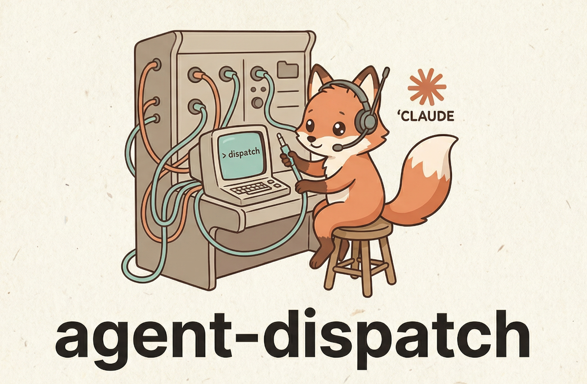

# agent-dispatch

[](https://pypi.org/project/agent-dispatch/)
[](https://github.com/ginkida/agent-dispatch/actions/workflows/ci.yml)
[](https://pypi.org/project/agent-dispatch/)
[](LICENSE)

**MCP server that lets Claude Code agents delegate tasks to agents in other project directories.**

<p align="center">
  
</p>

Each agent runs as a separate `claude -p` session in its own project directory — inheriting that project's MCP servers, CLAUDE.md, and tools. The calling agent just gets the result back.

Related projects can be bundled into a **[group](#groups)** — a shared brief plus a member list — so one session can coordinate work across them (e.g. code repos + an `infra`/Portainer gateway + an `analytics` gateway).

Works with OAuth, API key, and Claude subscription authentication.

> **AI agents:** this README is the canonical doc for *using* the tool — setup: [Quick Start](#quick-start) (every step has a deterministic verify), first call: [`dispatch`](#dispatch), tool selection: [Which Tool to Use](#which-tool-to-use), failure handling: [Error Recovery](#error-recovery). Working *on* this repo instead? See [AGENTS.md](AGENTS.md).

## Quick Start

**Prerequisite:** the [Claude Code CLI](https://docs.anthropic.com/en/docs/claude-code) must be installed and authenticated. Check first:

```bash
claude --version   # must print a version — if it fails, install Claude Code before continuing
```

Then:

```bash
pip install agent-dispatch   # or: pipx install agent-dispatch

# 1. Create config + register the MCP server with Claude Code (user scope)
agent-dispatch init

# 2. Register project directories as agents — REPLACE the example paths with
#    real directories on your machine; they must exist (~ is expanded, relative
#    paths are resolved). Descriptions are auto-generated from project files.
#    No second project handy? Use the zero-setup block below instead.
agent-dispatch add infra ~/projects/infra
agent-dispatch add backend ~/projects/backend

# 3. Smoke test — dispatches a real task to the agent added in step 2 and prints
#    the answer; exit 0 on success. Default task when none given:
#    "What project is this? Describe in one sentence."
agent-dispatch test infra

# 4. Verify the whole install — prints "All checks passed." and exits 0 on success
agent-dispatch doctor
```

**Zero-setup alternative** for steps 2–3 (no second project needed — registers the current directory):

```bash
agent-dispatch add self . && agent-dispatch test self "Say hello"
```

Every Claude Code session now has the dispatch tools. Independent check: `claude mcp list` must print a line starting with `agent-dispatch:`. From inside a Claude Code session, the first MCP calls are `list_agents()`, then [`dispatch(...)`](#dispatch).

**If `init` fails to register the MCP server** (prints a warning instead of `Registered MCP server`), register manually:

```bash
claude mcp add-json agent-dispatch "{\"type\":\"stdio\",\"command\":\"$(which agent-dispatch)\",\"args\":[\"serve\"]}" --scope user
```

**If `test` fails with a permission error** (`error_type: "permission"`), grant tool access and re-test:

```bash
agent-dispatch update infra --allowed-tools "Bash,Read,Grep"      # least privilege
# or, if the agent needs everything (see SECURITY.md for the trade-off):
agent-dispatch update infra --permission-mode bypassPermissions
```

## When to Dispatch

**Do dispatch** when a task needs tools, files, or context from another project:
- Check container logs via infra agent's Portainer MCP
- Query a database via db agent's postgres MCP
- Read code or run tests in another repository

**Don't dispatch** when you can do it yourself — dispatching spawns a full Claude session.

## MCP Tools Reference

### `list_agents`

Lists all configured agents. **Call this first** to see what's available.

```json
// Response (capability + permission fields shown only when populated)
[
  {
    "name": "infra",
    "directory": "/home/user/projects/infra",
    "description": "Infrastructure agent. MCP: portainer. Stack: Python, Docker",
    "healthy": true,
    "has_claude_md": true,
    "has_mcp_config": true,
    "mcp_servers": ["portainer", "postgres"],
    "stacks": ["Python", "Docker"],
    "dbs": ["Alembic"],
    "capabilities": ["docker_logs", "deploy_debug"],
    "risky_capabilities": ["restart_services"],
    "permission_mode": "bypassPermissions",
    "allowed_tools": ["Bash", "Read", "Grep"],
    "typical": {"median_seconds": 143.3, "p90_seconds": 178.3, "median_cost_usd": 0.2666}
  }
]
```

`mcp_servers`, `stacks`, and `dbs` are detected from the agent's project files (`.mcp.json`, `Dockerfile`, `pyproject.toml`, `Cargo.toml`, `prisma/`, `alembic.ini`, etc.) so callers can pick the right agent without dispatching a probe.

`typical` is **measured**, not declared: it comes from this agent's own recent dispatches in the [usage journal](#usage-journal--what-your-fleet-actually-costs) and appears only after a few runs. Use it to size `timeout_seconds` and to know what a call will cost before you make it. It is absent when the journal is off or the agent has too little history — no data is better than a typical duration derived from two runs.

### `inspect_agent`

Cheap detailed lookup — reads the agent's files without spawning a `claude` session. Returns the full config (timeout, model, budget, permission mode, allowed/disallowed tools), detected MCP/stacks/DBs, plus short previews of `CLAUDE.md` and `README.md` when present.

| Parameter | Type | Required | Description |
|-----------|------|----------|-------------|
| `name` | string | yes | Agent name from `list_agents` |
| `preview_lines` | int | no | Max lines of CLAUDE.md/README.md (default 40, max 200, 0 disables) |

Use this **before** `dispatch_async`/`dispatch` to confirm an agent has the tools and context for your task — much cheaper than a probe dispatch.

It also carries the agent's `instructions` (its standing orders) and the full `typical` block — the trimmed one in `list_agents` plus `dispatches`, `failed` and the `outcomes` breakdown:

```json
"typical": {
  "dispatches": 24, "median_seconds": 143.3, "p90_seconds": 178.3,
  "median_cost_usd": 0.2666, "failed": 1, "outcomes": {"done": 21, "partial": 2}
}
```

### Groups

A **group** bundles related agents into a cross-project working set — typically a few code repos plus capability gateways (an `infra` agent with a Portainer MCP, an `analytics` agent with a browser + Yandex Metrica). It lets one orchestrating session coordinate work that spans code, deploy, and verification.

A group is a **descriptive layer, not an execution engine** — there is no router and no state machine. You pick members by reading their hints and coordinate with the normal dispatch tools. Two text fields target two audiences:

- `description` — **orchestrator-facing**: how to coordinate the group (the order of steps, who to call for what). Surfaced by `list_groups`/`inspect_group`, **never** injected into a member's prompt.
- `shared_context` — **member-facing facts** (stack names, counter ids, conventions) that hold regardless of which member reads them. Auto-prepended to a member's `context` when you pass `group=`.

Members reference agents by name; membership is many-to-many (a shared gateway can belong to several groups). Manage groups with the `agent-dispatch group` CLI (`add`/`list`/`inspect`/`update`/`remove`) or by editing `agents.yaml`.

**`list_groups()`** — cheap, no-subprocess readout of every group: description, member count, and each member's `use_for` hint + health. A member whose agent was removed is flagged `"unknown": true` rather than crashing.

**`inspect_group(name)`** — one group's full brief: `description`, the complete `shared_context`, and the member list. For a deep dive on a specific member, call `inspect_agent(member)` — `inspect_group` deliberately stays a cheap membership readout.

**Using a group** — pass `group=` to `dispatch` (or per-item in `dispatch_parallel`). The agent must be a member; its group's `shared_context` rides along automatically:

```python
# From the shop-web codebase, hand the deploy to the infra gateway.
# The "shop" group's facts (stack name, counter id) are auto-attached.
dispatch(
    agent="infra",
    task="Redeploy the shop-web container",
    caller="shop-web",
    goal="ship the checkout fix",
    group="shop",
)
```

`group=""` (the default) is byte-for-byte identical to a plain dispatch — the shared facts are folded into the `context` string, so the result cache disambiguates groups automatically and group-less calls are unaffected.

### `dispatch`

One-shot task delegation. Results are cached — identical requests within TTL return instantly.

| Parameter | Type | Required | Description |
|-----------|------|----------|-------------|
| `agent` | string | yes | Agent name from `list_agents` |
| `task` | string | yes | What to do — be specific, the agent has no context from your conversation |
| `context` | string | no | Extra context: error messages, code snippets, stack traces |
| `caller` | string | no | Your project/role — helps the agent understand who's asking |
| `goal` | string | no | Broader objective — helps the agent make better trade-offs |
| `response_format` | string | no | `"json"` to request a single JSON value; the parsed result lands in `parsed_result`. Empty = free-form text. |
| `return_ref` | bool | no | When `true`, returns just a `ref` + summary preview instead of the full result text. Use `fetch_result(ref)` to load the full text on demand. |
| `summary_chars` | int | no | Max chars of result text to include in the ref response (default 500). |
| `timeout_seconds` | int | no | One-off timeout override for this call (0 = agent's configured timeout; clamped to 10–7200). No config edit needed for known-long tasks. |
| `group` | string | no | Group name (from `list_groups`). The agent must be a member; the group's `shared_context` (member-facing facts) is auto-prepended to `context`. Empty = plain dispatch. See [Groups](#groups). |

```python
# Call — recommended form (always include caller and goal)
dispatch(
    agent="infra",                # must exist in list_agents()
    task="Check container logs for errors related to the scheduler service",
    context="Error: TypeError at scheduler.py:42",
    caller="backend",             # your project/role
    goal="debug production crash" # the broader objective
)
```

```json
// Response (success)
{
  "agent": "infra",
  "success": true,
  "result": "Found 3 errors in container logs: TypeError in scheduler.py:42...",
  "session_id": "sess-abc-123",
  "cost_usd": 0.02,
  "duration_ms": 5000,
  "num_turns": 2,
  "outcome": "done"
}

// Response (failure — error_type helps you handle programmatically)
{
  "agent": "infra",
  "success": false,
  "result": "",
  "error": "Tool_use is not allowed in this permission mode\n\nHint: ...",
  "error_type": "permission"
}
```

**`error_type` values:** `permission` (tool/action denied), `timeout`, `recursion` (dispatch depth exceeded), `not_found` (missing directory or CLI), `budget` (the `claude` CLI stopped the session at `max_budget_usd`), `usage_limit` (the Claude *account* hit its rate/session limit), `cli_error` (other failures). Permission, budget, usage-limit and timeout errors include an actionable hint.

**Resumable timeouts:** every fresh dispatch pre-assigns a session UUID (`--session-id`), so a timed-out dispatch still returns a `session_id` — the partial transcript survives the kill. The timeout error spells out the recovery: resume with `dispatch_session(agent, "Continue where you left off", session_id=...)`, retry with a bigger `timeout_seconds`, or use `dispatch_async`.

**Denied-tools visibility:** in non-interactive mode the claude CLI auto-denies tools the agent isn't allowed to use — the agent then often "succeeds" with an answer like *"I need your permission for one read-only query"*. When that happens the response carries the deterministic signal: `denied_tools` (parsed from the CLI's `permission_denials`) plus a `hint` explaining the result may be incomplete and how to grant access. `success` stays `true` — it's a soft signal, not a failure.

```json
// Response (success, but a tool was blocked)
{
  "agent": "analysis",
  "success": true,
  "result": "Here is the offline mapping. To finish I'd need to run one read-only query...",
  "denied_tools": ["Bash"],
  "hint": "1 tool call(s) were denied by permissions: Bash. The result may be incomplete..."
}
```

**Structured JSON output:** pass `response_format="json"` to ask the agent for a single JSON value. The runner appends an instruction footer ("respond with a single valid JSON value, no fences, no prose") and on success parses the response — the parsed value lands in `parsed_result`. The raw text is always in `result`. Parse failures leave `parsed_result=None` but don't fail the dispatch (soft mode).

```json
// Response with response_format="json"
{
  "agent": "infra",
  "success": true,
  "result": "{\"errors\": 3, \"first_at\": \"14:02\"}",
  "parsed_result": {"errors": 3, "first_at": "14:02"}
}
```

**Always pass `caller` and `goal`** — the dispatched agent sees a structured prompt:

```markdown
## Goal
debug production crash

## Dispatched by
backend

## Context
Error: TypeError at scheduler.py:42

## Task
Check container logs for recent errors related to the scheduler service
```

**The dispatch protocol and `outcome`.** `claude -p` on its own does not know it is being driven by another agent: given an ambiguous task it will happily end with *"Could you clarify which service you mean?"* — a billed run that answered nothing, and one that a plain cache would then serve again for the whole TTL. So every dispatch also appends a short **dispatch protocol** to the agent's system prompt (`--append-system-prompt`, never mixed into your task text):

- it is running non-interactively, dispatched by `caller`, and nobody will answer a question or approve an action — state the assumption and proceed, take the safer reading when two differ;
- a denied tool or a missing thing is something to report, not something to stop on — finish everything else that is possible;
- its time budget is about the agent's timeout (and its spend cap, if one is set) — scope the work to fit; a complete partial answer beats an unfinished perfect one;
- lead with the outcome, then the evidence; list what could not be done and why (this is what makes a `return_ref` summary — the **head** of the text — worth reading);
- end with one line, `STATUS: done`, `STATUS: partial` or `STATUS: blocked`.

That last line is lifted out of `result` into **`outcome`** — the agent's own verdict, deterministic to check: `"done"` means complete; `"partial"` / `"blocked"` mean the agent says the work is unfinished, the result names what is missing, and a `hint` spells out the continuation (usually `dispatch_session(..., session_id=...)`). Read `outcome` before reading the text. It never flips `success`, `partial` / `blocked` results are **not cached**, and a `dispatch_parallel(..., aggregate=...)` labels such members for the aggregator so a blocked report is not synthesized as a finished one. Absent when the agent did not report one — the protocol is off (`settings.dispatch_protocol: false`), `response_format="json"` was requested (the JSON footer governs the reply shape there), or the agent simply skipped it.

**Standing orders.** Per-agent `instructions` (set via `add_agent` / `update_agent` or `agent-dispatch update <name> --instructions "..."`) follow the protocol in the same system prompt on **every** dispatch — "read-only SQL only", "never restart a stack unless the task says so", "answer with exact log lines". Unlike `context`, which is per call, and unlike the project's own `CLAUDE.md`, which is written for an interactive session, these are the rules for *being dispatched*.

```json
// Response (success, but the agent says it did not finish)
{
  "agent": "infra",
  "success": true,
  "result": "Restarted horizon. Could not verify the queue drained: the redis container is not reachable from here.",
  "session_id": "sess-abc-123",
  "outcome": "partial",
  "hint": "The agent reports its work is PARTIAL — read the result for what is missing, then continue in the same session via dispatch_session(agent='infra', task='Continue where you left off', session_id='sess-abc-123') or re-dispatch with what it needed."
}
```

### `dispatch_session`

Multi-turn: continue a conversation with an agent. First call starts a session, pass `session_id` back to continue. Never cached.

| Parameter | Type | Required | Description |
|-----------|------|----------|-------------|
| `agent` | string | yes | Agent name |
| `task` | string | yes | Task or follow-up message |
| `session_id` | string | no | From previous response — empty for new session |
| `context` | string | no | Extra context |
| `caller` | string | no | Who is dispatching |
| `goal` | string | no | Broader objective |
| `timeout_seconds` | int | no | One-off timeout override (0 = agent default; clamped to 10–7200) |

`dispatch_session` is also the **timeout recovery path**: a timed-out `dispatch` returns a `session_id` — pass it here with `task="Continue where you left off"` to salvage the partial work instead of restarting.

```
Turn 1: dispatch_session("infra", "List running containers")
         → session_id: "sess-abc"

Turn 2: dispatch_session("infra", "Restart the nginx one", session_id="sess-abc")
         → agent remembers previous context
```

### `dispatch_parallel`

Run multiple tasks concurrently. Much faster than sequential `dispatch` calls.

| Parameter | Type | Required | Description |
|-----------|------|----------|-------------|
| `dispatches` | string (JSON) | yes | JSON array of `{"agent", "task", "context?", "caller?", "goal?", "response_format?", "return_ref?", "summary_chars?", "timeout_seconds?", "group?"}` (a per-item `group` validates membership up front and auto-injects its `shared_context`) |
| `aggregate` | string | no | Agent name to synthesize all results into one answer |

**Important:** `dispatches` is a JSON string, not a list.

```json
// Input
[
  {"agent": "infra", "task": "check pod logs for errors", "caller": "backend", "goal": "debug crash"},
  {"agent": "db", "task": "are all migrations applied?", "caller": "backend", "goal": "debug crash"}
]
```

```json
// Response (without aggregate)
[
  {"agent": "infra", "success": true, "result": "No errors in pod logs", ...},
  {"agent": "db", "success": true, "result": "All migrations applied", ...}
]
```

```json
// Response (with aggregate="backend")
{
  "individual_results": [
    {"agent": "infra", "success": true, "result": "No errors in pod logs", ...},
    {"agent": "db", "success": true, "result": "All migrations applied", ...}
  ],
  "aggregated": {
    "agent": "backend",
    "success": true,
    "result": "Summary: all systems nominal. No pod errors, all migrations applied."
  }
}
```

### `dispatch_stream`

Same as `dispatch` but shows live progress while the agent works. Use for long-running tasks. Not cached.

Progress notifications keep the latest 100 pending messages, capped at 300
characters each. If output arrives faster than the client can receive it,
older notifications are omitted with a count; the final result is unaffected.
Disconnecting or cancelling the tool call discards pending notifications and
stops buffering new ones. The worker still holds its concurrency slot until it
finishes.

Parameters are the same as `dispatch` except `return_ref`/`summary_chars` (streaming is incompatible with ref-mode) and `group` (group context injection is supported only on `dispatch` and per-item in `dispatch_parallel`).

### `dispatch_dialogue`

Two agents collaborate through multi-turn conversation. Never cached.

| Parameter | Type | Required | Description |
|-----------|------|----------|-------------|
| `requester` | string | yes | Agent with the problem/context |
| `responder` | string | yes | Agent with the expertise/tools |
| `topic` | string | yes | Problem or question to discuss |
| `max_rounds` | int | no | Max back-and-forth rounds (default: 3, max: 10) |

Each round costs up to 2 dispatches. Agents signal completion with `[RESOLVED]`.

```json
// Response
{
  "resolved": true,
  "rounds": 2,
  "total_cost_usd": 0.04,
  "total_duration_ms": 12000,
  "final_answer": "Staging had 1 pending migration. Applied successfully.",
  "conversation": [
    {"agent": "db", "role": "responder", "round": 1, "message": "Which environment?", "cost_usd": 0.01},
    {"agent": "backend", "role": "requester", "round": 1, "message": "Staging", "cost_usd": 0.01},
    {"agent": "db", "role": "responder", "round": 2, "message": "Applied. [RESOLVED]", "cost_usd": 0.01}
  ]
}
```

### `add_agent`

Register a new project directory as an agent. Description is auto-generated from project files if omitted.

| Parameter | Type | Required | Description |
|-----------|------|----------|-------------|
| `name` | string | yes | Agent name (letters, digits, hyphens, underscores) |
| `directory` | string | yes | Path to an existing project directory (`~` is expanded, relative paths resolved) |
| `description` | string | no | What this agent can do — auto-generated if empty |
| `timeout` | int | no | Timeout in seconds (0 = 300; this is a literal default, not `settings.default_timeout`) |
| `max_budget_usd` | float | no | Finite max cost in USD per dispatch (0 = inherit `settings.default_max_budget_usd`; no cap only when that is unset too) |
| `permission_mode` | string | no | Permission mode (e.g. `default`, `plan`, `bypassPermissions`) |
| `allowed_tools` | string | no | Comma-separated allowed tools (e.g. `"Bash,Read,Edit"`) |
| `disallowed_tools` | string | no | Comma-separated disallowed tools |
| `capabilities` | string | no | Comma-separated capability labels (e.g. `"docker_logs,deploy_debug"`) |
| `risky_capabilities` | string | no | Comma-separated high-risk labels (e.g. `"restart_services"`) |
| `instructions` | string | no | Standing orders appended to the agent's system prompt on every dispatch (see [the dispatch protocol](#dispatch)) |

### `update_agent`

Update an existing agent's configuration. Only non-empty fields are changed. Pass `"none"` to clear a field.

| Parameter | Type | Required | Description |
|-----------|------|----------|-------------|
| `name` | string | yes | Agent name to update |
| `description` | string | no | New description |
| `timeout` | int | no | New timeout (0 = don't change) |
| `max_budget_usd` | float | no | New budget limit (0 = don't change; negative clears the *per-agent* cap, after which `settings.default_max_budget_usd` applies) |
| `model` | string | no | Model override. `"none"` to clear |
| `permission_mode` | string | no | Permission mode. `"none"` to clear |
| `allowed_tools` | string | no | Comma-separated. `"none"` to clear |
| `disallowed_tools` | string | no | Comma-separated. `"none"` to clear |
| `capabilities` | string | no | Comma-separated. `"none"` to clear |
| `risky_capabilities` | string | no | Comma-separated. `"none"` to clear |
| `instructions` | string | no | Standing orders for every dispatch (replaces the text). `"none"` to clear |

Changing an agent's config through an MCP mutation tool drops its cached results immediately. Cache keys also include the agent configuration and dispatch defaults, so edits through the CLI, another server, or YAML take effect on the next request. A worker finishing with an older configuration cannot overwrite answers for the new configuration. Unchanged agents keep their cache.

### `remove_agent`

Remove an agent from config.

| Parameter | Type | Required | Description |
|-----------|------|----------|-------------|
| `name` | string | yes | Agent name to remove |

### `cache_stats` / `cache_clear`

View cache hit rate and size, or clear all cached results.

### Result references — `return_ref` + `fetch_result`

For dispatches whose result text is large (audits, log dumps, code searches), passing the full text back inflates the calling agent's context. Use `return_ref=True` to get just a small reference instead:

```
dispatch(agent="infra", task="audit every container", return_ref=True, summary_chars=200)
  -> {"ref": "8f3a...e1", "agent": "infra", "success": true,
      "size": 14823, "summary_chars": 200,
      "summary": "Inspected 32 containers. Found 3 OOM kills in the last hour:\n- worker-3...",
      "cost_usd": 0.08, "duration_ms": 9200}

// Later, when you actually need to read the result:
fetch_result(ref="8f3a...e1")              -> full DispatchResult JSON
fetch_result(ref="8f3a...e1", max_chars=2000)  -> truncated, plus {"truncated": true, "full_size": 14823}
```

Refs reuse the same storage as `dispatch_async` jobs (under `~/.config/agent-dispatch/jobs/`), so any `job_id` returned by `dispatch_async` is also a valid `ref` for `fetch_result`. `parsed_result` (when `response_format="json"` is set) is small and is always inlined directly in the ref response — no second fetch needed.

### Async dispatch — `dispatch_async`, `dispatch_status`, `dispatch_wait`, `dispatch_cancel`, `dispatch_jobs`, `dispatch_gc`

When a dispatched task is going to take a while, you don't want to block your own tool slot for minutes. Async dispatch returns a `job_id` immediately and lets you check back when you're ready.

```
// 1. fire and forget (timeout_seconds= works here too for known-long tasks)
dispatch_async(agent="infra", task="audit every container log for OOM kills today")
  -> {"job_id": "8f3a...e1", "status": "pending", "agent": "infra"}

// 2. do other work, then check progress (non-blocking)
//    `progress` is a rolling tail of what the agent is doing right now
dispatch_status(job_id="8f3a...e1")
  -> {"id": "8f3a...e1", "status": "running", "started_at": 1730000123.4,
      "progress": ["Using tool: Bash", "Scanning container logs for OOM events..."], ...}

// 3. or block until done (timeout_seconds default: 60, capped at 3600)
dispatch_wait(job_id="8f3a...e1", timeout_seconds=120)
  -> {"id": "8f3a...e1", "status": "done", "result": {"agent": "infra", "success": true, ...}}

// If the timeout fires, the job keeps running:
  -> {"id": "...", "status": "running", "timed_out_waiting": true}
```

`dispatch_cancel(job_id)` cancels a **pending** job, and also kills a **running** job's `claude` process group when the job was started by the same server instance (the job is marked `cancelled` first, so the worker's trailing write can't undo it; partial work is lost but the progress tail is preserved). On POSIX, descendants in that process group are killed too, releasing inherited pipes and the concurrency slot. A cancel that lands after the job was claimed but before its process spawned is honored too: the process is killed as soon as it starts. A compatibility retry that races cancellation is killed when it registers. A running job started by a *previous* server run can't be killed safely and is left to finish. The response carries an `outcome` of `cancelled`, `cancelled_running`, `running` (not owned by this server), `already_terminal`, or `not_found`.

Async workers run with streaming under the hood: the job file keeps a rolling tail (last 20 lines, ~1 write/sec) of assistant text and tool-use events. `dispatch_status` shows it as `progress` while the job runs and keeps it afterwards as a post-mortem trace; `dispatch_jobs` shows `last_progress` for running jobs.

`dispatch_jobs(status?, limit=50, agent?)` lists recent jobs as summaries (filter by `pending` / `running` / `done` / `failed` / `cancelled`). `agent` matches an exact name, including agents since removed from configuration; both filters apply before the limit. `dispatch_gc(max_age_days=7)` purges terminal jobs older than the threshold — pending and running jobs are never deleted. Use `dry_run=True` to preview eligible job IDs without deleting them.

Job state persists to disk at `~/.config/agent-dispatch/jobs/` (override with `AGENT_DISPATCH_JOBS_DIR`). One JSON file per job, written owner-only (`0o600`) with atomic writes — safe to read or `ls` while jobs are in flight. Caller-supplied `job_id`s are validated as 32-char hex before any file access (no path traversal). On startup the server recovers jobs a crashed instance abandoned: `running` ones stuck over an hour, and `pending` ones over 24 hours, are marked `failed` so they stop being polled forever and become collectable by `dispatch_gc`. (The `pending` threshold is deliberately long — the jobs directory is shared by every running server, so a job queued behind another server's concurrency limit must not be swept.)

| When to use async | When to use `dispatch` |
|-------------------|------------------------|
| Long task (minutes) — you want to keep working | Short task — you need the answer right now |
| Several long tasks you'll collect later | Several short tasks → `dispatch_parallel` |
| Don't care about caching (each call is a fresh job) | Cached by default — identical requests are free |

## Which Tool to Use

| Scenario | Tool |
|----------|------|
| Quick one-off question to another project | `dispatch` |
| Multi-step workflow with follow-ups | `dispatch_session` |
| Need answers from several agents at once | `dispatch_parallel` |
| Long task, want to see progress | `dispatch_stream` |
| Two agents need to collaborate | `dispatch_dialogue` |
| Need a combined summary from multiple agents | `dispatch_parallel` with `aggregate` |
| Long task — don't block your tool slot | `dispatch_async` + `dispatch_wait` |
| Check progress without blocking | `dispatch_status` |
| Known-long task, one-off | any dispatch tool with `timeout_seconds=...` |
| A dispatch timed out | `dispatch_session` with the `session_id` from the error |
| Coordinating a set of related projects | define a [group](#groups), then `dispatch(..., group=name)` |
| See which agents form a working set | `list_groups` / `inspect_group` |

## Error Recovery

Failures are deterministic: check `success`, then branch on `error_type`.

| `error_type` | Meaning | Recovery |
|--------------|---------|----------|
| `permission` | A tool call was denied | `update_agent(name, allowed_tools="Bash,Read")` (least privilege) or `update_agent(name, permission_mode="bypassPermissions")`, then re-dispatch. The `error` text includes a hint with the exact fix. |
| `timeout` | Process group killed at the timeout | Resume the partial work: `dispatch_session(agent, "Continue where you left off", session_id=<from the error text>)`. Or retry with a bigger `timeout_seconds=` — once the journal has history the error names the value that would have covered this agent's p90 — or use `dispatch_async`. Both ordinary and streaming dispatches preserve a complete CLI result received before termination; a successful result includes a cleanup `hint`. Partial output remains a timeout. |
| `not_found` | Agent directory or `claude` CLI missing | `list_agents()` → check `healthy`. Re-add the agent with an existing path, or run `agent-dispatch doctor` to find what's missing. |
| `recursion` | Dispatch nesting exceeded `max_dispatch_depth` (default 3) | Don't dispatch from dispatched agents; if the nesting is intentional, raise `max_dispatch_depth` in settings. |
| `budget` | The `claude` CLI ended the session at the `max_budget_usd` spend cap — the answer is incomplete | Raise the cap (`update_agent(name, max_budget_usd=2.0)`), switch to a cheaper `model`, or split the task. The partial session is resumable: `dispatch_session(agent, "Continue where you left off", session_id=<from the result>)`. |
| `usage_limit` | The Claude **account** hit its usage/rate limit — not this agent, and nothing was billed | Wait for the reset named in the `error` text. Dispatching a *different* agent is not a workaround: every agent runs on the same account. If it recurs under load, lower `settings.max_concurrency`. |
| `cli_error` | Anything else from the `claude` subprocess | Read the `error` text; run `agent-dispatch doctor` for environment issues; retry once if transient. |

Three soft signals that arrive with `success: true`:

- **`denied_tools` + `hint`** — the agent finished but some tool calls were blocked; the result may be incomplete. Grant access (see the `permission` row) and re-dispatch.
- **`outcome: "partial"` / `"blocked"`** — the agent's own verdict that it did not finish; the result names what is missing and the `hint` carries the `dispatch_session(...)` call to continue in the same session. Not cached, so a re-dispatch after fixing the cause runs fresh.
- **`parsed_result: null` with `response_format="json"`** — the reply wasn't valid JSON; the raw text is still in `result`. Caveat: an agent that *can't* comply returns `{"error": "<reason>"}` — which parses successfully — so also check `parsed_result` for an `"error"` key.
- **`budget_exceeded: true`** — `cost_usd` came in over the agent's `max_budget_usd` (or the settings default) without the CLI stopping the run (the final turn can overshoot the cap). The dispatch is not failed — the money is already spent — but a runaway agent is now visible. Tighten the task, pick a cheaper model, or raise the budget. A run the CLI *did* stop fails with `error_type: "budget"` instead.

Tool-level errors (unknown agent, malformed input) return a plain envelope instead of a `DispatchResult`:

```json
{"error": "Unknown agent: 'foo'. Available: infra, db, monitoring"}
```

## Configuration

Config at `~/.config/agent-dispatch/agents.yaml` (override: `AGENT_DISPATCH_CONFIG` env var):

```yaml
agents:
  infra:
    directory: ~/projects/infra
    description: "Infrastructure agent. MCP: portainer."
    timeout: 300            # seconds, default: 300
    capabilities:           # capability labels, shown in list_agents
      - docker_logs
      - deploy_debug
    risky_capabilities:     # high-risk labels, surfaced for visibility
      - restart_services
    # instructions: |       # standing orders, appended to the system prompt on every dispatch
    #   Read-only: never restart or redeploy unless the task says so.
    #   Quote exact log lines with timestamps.
    # model: sonnet         # optional model override
    # max_budget_usd: 1.0   # cost limit per dispatch
    # permission_mode: bypassPermissions  # one of: default | plan | bypassPermissions
    # allowed_tools:        # restrict which tools the agent can use
    #   - Read
    #   - Grep
    # disallowed_tools:     # block specific tools
    #   - Write

# Optional: bundle related agents into a cross-project working set.
# A descriptive layer — no router; the orchestrating session coordinates
# with the normal dispatch tools. See the Groups section above.
groups:
  shop:
    # ORCHESTRATOR-facing: how to coordinate the group. Surfaced by
    # list_groups/inspect_group, NEVER injected into a member's prompt.
    description: "After a code change: deploy via infra, then verify via analytics."
    # MEMBER-facing facts, auto-prepended to dispatch(..., group="shop").
    shared_context: |
      Prod runs in Portainer stack "shop". Metrica counter 12345.
    members:                # reference agents above (many-to-many)
      - agent: infra
        use_for: deploy, restart, container logs
      # - agent: backend
      #   use_for: orders/payments endpoints

settings:
  default_timeout: 300
  # default_permission_mode: bypassPermissions  # inherited by all agents
  # default_allowed_tools:                      # inherited when agent has none
  #   - Bash
  #   - Read
  #   - Edit
  max_dispatch_depth: 3     # recursion protection
  max_concurrency: 5        # max parallel claude -p processes per server, across all tools
  # dispatch_protocol: true # send every agent the dispatch protocol (non-interactive,
  #                         # time budget, STATUS line → `outcome`). false = raw claude -p.
  # usage_log: true         # record every dispatch in usage.jsonl (cost, duration, outcome).
  #                         # Powers `agent-dispatch stats`, the `typical` block and the
  #                         # measured timeout suggestion. false = record nothing.
  # job_retention_days: 30  # 0 (default) = never prune. See "Job retention" below.
  cache:
    enabled: true
    ttl: 300                # seconds
    max_size: 1000          # max cached entries; oldest evicted first (FIFO)
```

Config is reloaded on every tool call — add agents without restarting.

### Usage journal — what your fleet actually costs

Every dispatch appends one line to `~/.config/agent-dispatch/usage.jsonl`
(override with `AGENT_DISPATCH_USAGE_LOG`): agent, success, cost, duration,
turns, `outcome`, error type, caller. Cache hits are recorded too, flagged
`cached`, so the report can show what the cache saves.

```console
$ agent-dispatch stats --days 7
Usage (last 7 day(s))
  dispatches: 33, 1 served from cache
  spend:      $13.0390
  duration:   median 87s, p90 2m40s, max 10m00s
  outcomes:   blocked 1, done 27, partial 3
  failures:   timeout 1, usage_limit 1

Per agent
  analytic           18 runs  $  8.9441  median  2m04s  p90  2m51s
      done 15, partial 3
  gitlab             12 runs  $  3.7949  median    60s  p90    86s
      done 12  |  1 cached
```

`--agent NAME` narrows it, `--json` emits the same report as JSON.

The journal is what makes three other things work: the `typical` block in
`list_agents` / `inspect_agent`, the timeout error naming a value derived from
the agent's real p90 instead of a doubling guess, and any answer at all to
"which agent is expensive". Turn it off with `usage_log: false` in settings.

Properties worth knowing: the file is owner-only (`0o600`); each record is a
single `O_APPEND` write capped well under `PIPE_BUF`, so the CLI and every
running server can share it with no lock and no torn lines; it rotates to
`usage.jsonl.1` at ~2 MB and keeps two generations, so it is bounded at ~4 MB
forever. A failure to write it can never fail a dispatch.

### Job retention

Every `dispatch_async` **and** every `dispatch(..., return_ref=True)` writes a
record to `~/.config/agent-dispatch/jobs/`, and nothing deletes it on its own —
`dispatch_gc` has to be run by hand. The directory therefore grows without
bound, and `dispatch_jobs` plus the stale-job recovery that runs at every server
start read and parse *every* file in it.

Set `job_retention_days` to prune terminal (done/failed/cancelled) records older
than N days when a server starts:

```yaml
settings:
  job_retention_days: 30
```

It defaults to `0` — **off** — because those records are your own history of
past dispatches and deleting them cannot be undone. Pending and running jobs are
never touched.

`agent-dispatch gc --days N` and the `dispatch_gc` tool apply the same rule as a
one-off. Preview eligible records before deleting them:

```bash
agent-dispatch gc --days 30 --dry-run
agent-dispatch gc --days 30
```

`--dry-run` also works with `--all`. The MCP equivalent is
`dispatch_gc(max_age_days=30, dry_run=True)`, returning `dry_run: true`,
`purged: 0`, `would_purge`, `job_ids`, and `max_age_days`.
A preview is a snapshot; deletion checks eligibility again, so its count can
change as jobs finish. Unreadable records, invalid timestamps, and records whose
internal ID differs from their filename are skipped and preserved for inspection.

### Auto-Description

`agent-dispatch add` without `--description` generates one from:

- `CLAUDE.md` — first meaningful paragraph (priority)
- `README.md` — first substantial line (fallback)
- `pyproject.toml` / `package.json` — project description
- `.mcp.json` — lists MCP server names
- Stack indicators — Docker, Rust, Go, Python, Node.js
- DB indicators — Prisma, Alembic, migrations

### Explicit Capabilities

Auto-description is useful, but explicit `capabilities` make it clearer what each agent is for. Add short snake_case task labels to agents:

```bash
agent-dispatch update infra \
  --capabilities docker_logs,deploy_debug \
  --risky-capabilities restart_services
```

`list_agents` and `inspect_agent` surface `capabilities` and `risky_capabilities` so the caller can pick the right agent at a glance — `risky_capabilities` flags higher-risk abilities (e.g. restarting services) for extra scrutiny.

## How It Works

```
Your Claude Code session
  │
  ├─ dispatch("infra", "find errors", caller="backend", goal="debug crash")
  │
  ▼
agent-dispatch MCP server
  ├─ cache check → hit? return cached result
  ├─ shared process limit → bound concurrency across all dispatch tools
  └─ subprocess.Popen(["claude", "-p", ...], cwd=~/projects/infra/)
       │
       ▼
     New Claude Code session in ~/projects/infra/
       ├─ Inherits: CLAUDE.md, .mcp.json, project tools
       ├─ System prompt += dispatch protocol + the agent's standing `instructions`
       ├─ Receives structured prompt with goal/caller/context/task
       └─ Returns result (+ its own STATUS → `outcome`) → cached when complete
                    │
                    └─ one line appended to usage.jsonl (cost, duration, outcome)
```

## Safety

- **Recursion protection** — `AGENT_DISPATCH_DEPTH` env var tracks nesting. Default limit: 3. Best-effort across the subprocess boundary (see [SECURITY.md](SECURITY.md)).
- **Argument-injection guard** — structured CLI fields (`session_id`, `model`, `permission_mode`, tool names) that start with `-` are rejected so they can't smuggle extra `claude` flags.
- **Path-traversal guard** — caller-supplied `job_id`/`ref` values are validated as 32-char hex before any filesystem access.
- **Owner-only state** — job files, `agents.yaml`, the usage journal and the server registry are all written `0o600`; their directories are `0o700`.
- **Cost control** — `max_budget_usd` per agent or globally is passed to the `claude` CLI as `--max-budget-usd`, so a runaway dispatch is stopped at the cap and comes back as `error_type: "budget"` with a resumable `session_id`. An overshoot that lands over budget without stopping is flagged post-hoc with `budget_exceeded: true` + a hint.
- **Concurrency** — `max_concurrency` (default: 5) caps parallel `claude -p` processes across all dispatch tools within one server process. Ordinary, streaming, and background dispatches share the same limit, and waiting calls are served in arrival order, so a queue of background jobs cannot starve an interactive call. Cancelling a waiting call never starts its process; cancelling an already-started ordinary or streaming call keeps its slot occupied until the worker ends. Reloading a changed limit preserves occupied slots: lowering it lets existing work finish and holds new launches until capacity is available. Separate server processes each have their own limit.
- **Timeout** — per-agent or global (default: 300s). Both ordinary and streaming dispatches run the agent in its own process group. On POSIX, the deadline kills that group, including descendants that inherited output pipes. Ordinary dispatch also bounds cleanup to one additional second if a descendant deliberately detached from the group; that detached process is outside the group's reach. A complete CLI result survives cleanup timeout, with a hint on successful results.
- **Caching** — identical `(agent, task, context, caller, goal, response_format)` requests under the same agent configuration and dispatch defaults return cached results, bounded by `cache.max_size` (oldest entry evicted first). Only clean successes are cached: failures, results with `denied_tools`, results flagged `budget_exceeded`, and results the agent itself reported as `partial` / `blocked` are not, so the documented "grant access / raise the cap, then re-dispatch" recovery is never served a stale crippled answer. Changing an agent's config invalidates its entries. Sessions and dialogues are never cached. A `group=` dispatch folds the group's `shared_context` into `context`, so different groups cache separately and a plain dispatch is unaffected.
- **Durable config** — `agents.yaml` is written atomically (temp file + rename), so an interrupted write can never truncate it. Every mutation path (CLI and MCP server alike) also takes a cross-process advisory lock, so concurrent edits don't drop one another's agents. The lock is best-effort by design: after waiting 10 seconds it logs a warning and proceeds anyway, because a wedged lock holder must not freeze the MCP server — so on a heavily contended config a lost update is possible, while a truncated one is not.

See [SECURITY.md](SECURITY.md) for the full threat model (including the `bypassPermissions` escalation risk and on-disk job files).

## CLI

| Command | Description |
|---------|-------------|
| `agent-dispatch init` | Create config + register MCP server with Claude Code |
| `agent-dispatch add <name> <dir>` | Add an agent (auto-generates description) |
| `agent-dispatch update <name>` | Update agent config (permissions, timeout, model, `--instructions`, etc.) |
| `agent-dispatch remove <name>` | Remove an agent |
| `agent-dispatch list` | List agents with health status and permissions |
| `agent-dispatch group <add\|list\|inspect\|update\|remove>` | Manage [groups](#groups) — cross-project working sets of agents |
| `agent-dispatch describe <name>` | Show full configuration for one agent (tri-state tools, project files) |
| `agent-dispatch test <name> [task] [--stream]` | Test an agent with a dispatch (`--stream` for live progress) |
| `agent-dispatch stats [--days N --agent X --json]` | What dispatches cost: spend, durations, outcomes and failures per agent |
| `agent-dispatch doctor [--json --strict]` | Diagnose installation, stale servers, MCP registration, agent health, and group membership; `--strict` also fails on warnings |
| `agent-dispatch jobs [--status STATUS --agent NAME --limit N --json]` | List recent job summaries, including results stored with `return_ref` |
| `agent-dispatch job <id> [--json]` | Show one job; `--json` exports the full record without truncation |
| `agent-dispatch cancel <id>` | Cancel a pending job (running jobs: use the `dispatch_cancel` MCP tool) |
| `agent-dispatch gc [--days N \| --all] [--dry-run]` | Purge terminal jobs older than N days (default 7; `--all` purges every age); `--dry-run` previews without deleting |
| `agent-dispatch serve` | Start MCP server (stdio, used by Claude Code) |

To check an installation from a script:

```bash
agent-dispatch doctor --json --strict > diagnostics.json
```

The report contains `schema_version: 1`, overall `status` (`ok`, `warn`, or
`fail`), `issues` and `warnings` counts, and a `checks` array. Each check has a
`section`, `status`, `message`, and `details` array containing any remediation
steps or supporting information. JSON is emitted even when checks fail.
Failures exit with code 1; warnings exit with code 0 unless `--strict` is set.
The same checks and exit policy apply to the normal human-readable output.
This checks installation and configuration; it does not run a paid dispatch.

To inspect history from scripts or save a full result:

```bash
agent-dispatch jobs --agent infra --status failed --limit 10 --json
agent-dispatch job <job_id> --json > job.json
```

`jobs --json` returns an array of compact summaries in the same format as
`dispatch_jobs`, or `[]` if no jobs match. Each summary includes the ID, agent,
status, first 120 task characters, and timestamps; result cost, success, outcome,
error type, and latest running progress are included when available.
`job --json` returns the full stored job, including task/context, progress,
result text, structured result, session ID, and recovery hints when present.
Both formats preserve Unicode. Reading a failed job still exits successfully:
check its `status` and `result.success` to determine the dispatch outcome.
Missing/invalid job IDs and storage-open failures return `{"error": "..."}`
with exit code 1. Invalid command-line options are reported by Click on stderr.

Invalid or non-finite cost metadata is treated as unknown and omitted from
result exports; it does not hide the stored result text. Usage summaries ignore
unusable numeric measurements, and doctor omits uptime when a server's start
timestamp is unreadable.

## Requirements

- Python >= 3.10
- [Claude Code CLI](https://docs.anthropic.com/en/docs/claude-code) installed, authenticated, and on `PATH` (verify: `claude --version`)

## License

MIT
